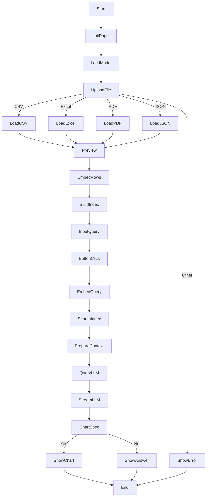

# LLM Data Query System

## Overview

This project is a Streamlit application that leverages a Groq LLM (Llama 3.1 70B) and FAISS vector database for natural language querying of tabular data. It supports ingestion of CSV, Excel, PDF, and JSON files, enabling detailed, row-specific, column-based, numeric, and range-based queries, and generates Altair charts for visualization.

## Data Ingestion Approach

Our system supports four input formats:
1. **CSV Files**: Processed using pandas' `read_csv` with automatic header detection.
2. **Excel Files**: Processed using pandas' `read_excel`, handling all sheets automatically.
3. **PDF Files**: Processed using PyMuPDF (fitz), extracting text page-by-page.
4. **JSON Files**: Processed using pandas.

Each format is converted to a pandas DataFrame with standardized columns:
- For tabular data (CSV/Excel/JSON): Columns are combined with their headers.
- For PDFs: Each page becomes a row with the text content.

## Retrieval Strategies

### Table-Aware Hybrid RAG

We implemented a **Table-Aware Hybrid RAG** approach that:
- Preserves tabular structure when processing CSV/Excel/JSON files.
- Handles free-form text from PDFs effectively.
- Uses metadata to track data provenance.

### Hybrid Row+Parameter Chunking

Our chunking strategy:
- For tabular data:
  - Maintains row integrity.
  - Includes relevant column headers.
  - Preserves relationships between data points.
- For text data:
  - Uses semantic paragraph boundaries.
  - Maintains page context for PDFs.

## Pre/Post-Processing Optimizations

### Pre-processing
- Automatic header detection for CSV/Excel.
- Text normalization for PDF content.
- Column name standardization.

### Post-processing
- Context-aware result ranking.
- Query-dependent result filtering.
- Response formatting based on query type.

## Technical Stack

- **LLM**: Groq Llama 3.1 70B (temperature=0.1)
- **Embedding Model**: all-mpnet-base-v2
- **Vector Database**: FAISS (IndexHNSWFlat)
- **UI Framework**: Streamlit

## Limitations

1. **PDF Processing**:
   - Only extracts raw text
   - Doesn't handle complex layouts or embedded tables
2. **Excel Processing**:
   - Limited support for complex cell formatting
3. **Visualization**:
   - Basic chart types only (line, bar, scatter)

## Future Improvements

1. **OCR Integration**: Add support for table images → OCR → ingestion
2. **Enhanced PDF Processing**: Implement table extraction from PDFs
3. **Advanced Visualization**:
   - More chart types (heatmaps, histograms)
   - Interactive visualizations
4. **Performance Optimization**:
   - Parallel processing for large files
   - Caching mechanisms for frequent queries

## Usage

1. Install dependencies: `pip install -r requirements.txt`
2. Run the app: `streamlit run app.py`
3. Upload your file (CSV, Excel, PDF, or JSON)
4. Enter your query in natural language
5. View results and visualizations

## Application Flow Chart

---
